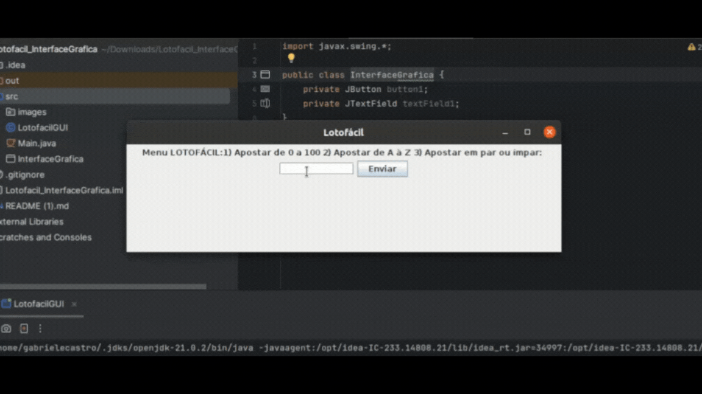

# LOTOFÁCIL em java

Lotofácil Interface Gráfica -  em Java

O Lotofácil é um sistema de loteria desenvolvido em Java que permite aos usuários fazer apostas de três tipos diferentes: de 0 a 100, de A a Z e em números pares ou ímpares. O sistema verifica os resultados e calcula os prêmios de acordo com as regras da loteria.

REQUISITOS DO PROJETO
O sistema deve permitir que os usuários façam apostas de três tipos diferentes.
Deve verificar os resultados das apostas e calcular os prêmios de acordo com as regras da loteria.
Deve fornecer uma interface gráfica simples para interação com o usuário.

TECNOLOGIAS UTILIZADAS
Linguagem de Programação: Java
Bibliotecas Utilizadas: javax.swing., java.awt., java.util.Random

COMO RODAR O PROJETO
Certifique-se de ter o JDK (Java Development Kit) instalado na sua máquina.
Baixe o código fonte do projeto.
Abra o projeto em um ambiente de desenvolvimento Java, como o IntelliJ IDEA ou Eclipse.
Compile e execute a classe LotofacilGUI.
A interface gráfica do Lotofácil será exibida, permitindo que você faça suas apostas.

COMO JOGAR
Escolha o tipo de aposta digitando 1, 2 ou 3, conforme o menu exibido na tela.
Digite sua aposta de acordo com as instruções fornecidas.
Clique no botão "Enviar" para processar sua aposta.
O sistema mostrará se você ganhou ou não o prêmio.